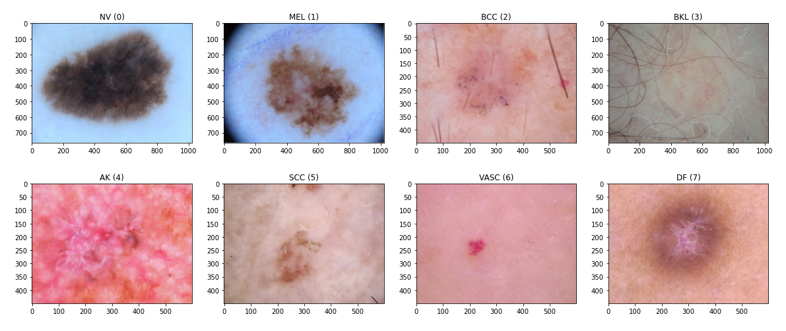
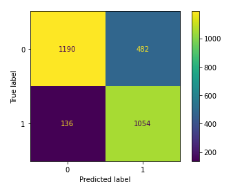

# Skin Tumors Classification

_Personal Machine Learning Project_<br/>
_[Antonio Scardace](https://linktr.ee/antonioscardace)_ @ _Dept of Math and Computer Science, University of Catania_

[](https://www.codefactor.io/repository/github/antonioscardace/isic-2019-v2/overview/main)
[](https://github.com/antonioscardace/isic-2019-v2/blob/master/LICENSE)
[](https://github.com/antonioscardace/isic-2019-v2/issues)
[](/docs/credits.txt)

## Introduction

Inspired by the groundbreaking paper titled "**[Skin Lesion Analysis Toward Melanoma Detection 2018: A Challenge Hosted by the International Skin Imaging Collaboration (ISIC)](https://arxiv.org/abs/1902.03368)**" for the **ISIC 2019** challenge, this project delves into the realm of dermatology, aiming to analyse and classify skin lesions from images.

With a dataset sourced from [Kaggle](https://www.kaggle.com/datasets/andrewmvd/isic-2019), comprising **25331 images**, I embark on the quest to classify dermoscopic images across **8 different diagnostic categories**: 
* Melanocytic nevus _(NV)_ **(50.83%)**
* Melanoma _(MEL)_ **(17.85%)**
* Basal cell carcinoma _(BCC)_ **(13.12%)**
* Benign keratosis (solar lentigo / seborrheic keratosis / lichen planus-like keratosis) _(BKL)_ **(10.36%)**
* Actinic keratosis _(AK)_ **(03.42%)**
* Squamous cell carcinoma _(SCC)_ **(02.48%)**
* Vascular lesion _(VASC)_ **(01.00%)**
* Dermatofibroma _(DF)_ **(0.94%)**



Zooming into tumour images, our focus sharpens on **19080 images** among **5 different diagnostic categories**. As the first version of the project, I aim to discern between **Benign** and **Malignant Tumors**, crafting a dichotomy between safety and peril. Here is the breakdown: 
* Melanocytic nevus _(NV)_ - _BENIGN_ **(55.72%)**
* Dermatofibroma _(DF)_ - _BENIGN_ **(01.23%)**
* Melanoma _(MEL)_ - _MALIGNANT_ **(22.78%)**
* Basal cell carcinoma _(BCC)_ - _MALIGNANT_ **(17.01%)**
* Squamous cell carcinoma _(SCC)_ - _MALIGNANT_ **(03.26%)**

The Dataset was divided into a Training Set (**85%**) and a Test Set (**15%**). **Data Augmentation** techniques were applied to the Training Set to enhance model performance. As a result, the final model achieved an accuracy of **78.41%** on the Test Set, with a precision of **88.57%** for the most significant class (Malignant Tumor).



## Getting Started

So that the repository is successfully cloned and the project runs, there are a few prerequisites:

* Adequate GPU cores and RAM for computational tasks.
* Free disk space of at least 10GB.

Then, follow these steps to get started:

```sh
   $ git clone https://github.com/antonioscardace/ISIC-2019-v2.git
   $ cd YOUR_PATH/ISIC-2019-v2/
   $ pip install -r requirements.txt
   $ mkdir models
```

Now, download the dataset from [Kaggle](https://www.kaggle.com/datasets/andrewmvd/isic-2019) and put the images in `/data/images/`.<br/>
You're all set! You can start working on the project utilising any [available notebook](/notebooks/).
